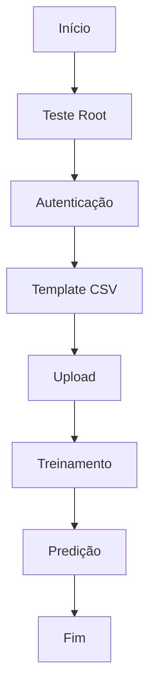

# Guia de Testes de Endpoint TenisMatch

## 📋 Sobre os Testes

O script `test_endpoints.py` foi desenvolvido para garantir a integridade e funcionamento correto da API TenisMatch. Ele realiza uma série de testes que simulam o fluxo completo de uso da API, desde a autenticação até as predições do modelo.

## 🎯 Objetivos dos Testes

1. Validar a disponibilidade da API
2. Verificar o sistema de autenticação
3. Testar o fluxo completo de dados
4. Garantir o funcionamento do modelo de ML
5. Identificar problemas de integração

## 🔍 Testes Implementados

### 1. Teste de Conexão (`test_root`)
- **O que testa**: Verifica se a API está online e respondendo
- **Por que é importante**: Validação básica de disponibilidade
- **Endpoint**: GET /
- **Resultado esperado**: Status 200 e informações básicas da API

### 2. Teste de Autenticação (`test_auth`)
- **O que testa**: Sistema de autenticação com diferentes usuários
- **Por que é importante**: Segurança e controle de acesso
- **Endpoints**: 
  - POST /api/v1/auth/token
  - GET /api/v1/auth/me
- **Usuários testados**:
  - admin@tenismatch.com / abc123
  - tester@tenismatch.com / abc123

### 3. Teste de Template CSV (`test_template_csv`)
- **O que testa**: Download e estrutura do template CSV
- **Por que é importante**: Garantir formato correto dos dados
- **Endpoint**: GET /api/v1/tennis/template-csv
- **Validações**:
  - Download do arquivo
  - Estrutura das colunas
  - Formato dos dados

### 4. Teste de Upload (`test_upload_csv`)
- **O que testa**: Upload e processamento de dados
- **Por que é importante**: Entrada de dados no sistema
- **Endpoint**: POST /api/v1/tennis/upload-csv
- **Requisitos**: Autenticação válida

### 5. Teste de Treinamento (`test_train_model`)
- **O que testa**: Pipeline de treinamento do modelo
- **Por que é importante**: Qualidade das predições
- **Endpoint**: POST /api/v1/tennis/train
- **Validações**: Métricas do modelo

### 6. Teste de Predição (`test_predict`)
- **O que testa**: Sistema de predições
- **Por que é importante**: Funcionalidade principal do sistema
- **Endpoint**: POST /api/v1/tennis/predict
- **Dados de teste**:
  ```json
  {
    "records": [{
      "tenis_estilo": "ESP",
      "tenis_marca": "Nike",
      "tenis_cores": "BLK",
      "tenis_preco": 299.99,
      "match_success": 0
    }]
  }
  ```

## 🚀 Como Executar os Testes

1. Garanta que o servidor está rodando:
```bash
uvicorn app.main:app --reload
```

2. Execute o script de testes:
```bash
python test_endpoints.py
```

3. Observe os logs para resultados detalhados

## 📊 Interpretando os Resultados

Os testes fornecem feedback detalhado:
- ✅ Sucesso: Teste passou sem problemas
- ❌ Erro: Detalhes do problema encontrado
- Logs detalhados de cada operação
- Tempo de execução de cada teste

## 🔍 Troubleshooting

### Erros Comuns

1. **Erro de Autenticação (401)**
   - Verifique as credenciais
   - Confirme se o token não expirou

2. **Erro de Validação (422)**
   - Verifique o formato dos dados
   - Confirme as colunas obrigatórias

3. **Erro de Servidor (500)**
   - Verifique os logs do servidor
   - Confirme o estado do modelo

### Dicas de Debug

1. Use os logs detalhados:
   - `./logs/api.log`
   - Output do console

2. Verifique os headers:
   - Autenticação
   - Content-Type

3. Monitore os dados:
   - Formato do CSV
   - Estrutura do JSON

## 🔄 Fluxo de Execução



## 📈 Boas Práticas

1. Execute os testes regularmente
2. Mantenha os dados de teste atualizados
3. Monitore os tempos de resposta
4. Verifique os logs após cada execução
5. Mantenha o ambiente isolado para testes

## 🚨 Alertas Importantes

1. Nunca use dados sensíveis nos testes
2. Mantenha backups dos templates
3. Monitore o uso de recursos
4. Verifique a consistência dos dados
5. Observe os timeouts

## 📝 Manutenção dos Testes

1. Atualize os testes quando:
   - Novos endpoints são adicionados
   - Requisitos mudam
   - Bugs são identificados
   - API é versionada

2. Documente alterações:
   - Novos casos de teste
   - Mudanças nos dados
   - Atualizações de configuração